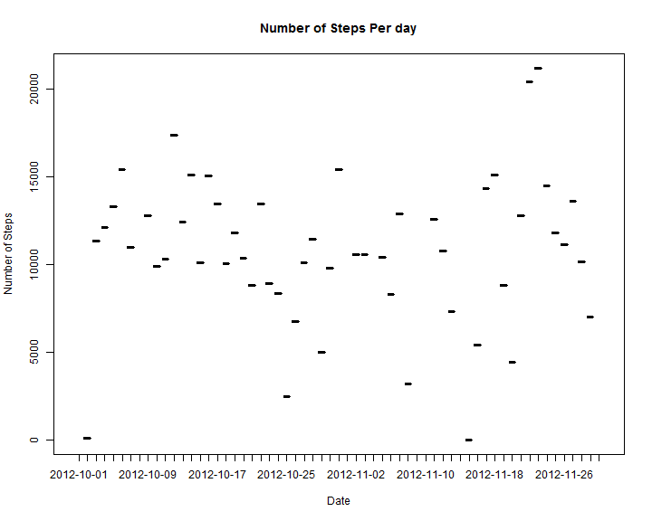
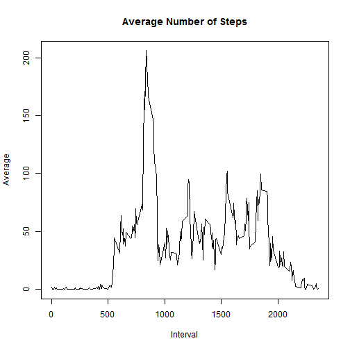

# Reproducible Research: Peer Assessment 1

## Loading and preprocessing the data
1. Load the data (i.e. read.csv())
2. Process/transform the data (if necessary) into a format suitable for your analysis

```r
library(xtable)
data <- read.csv("activity.csv")
```

Summary of the Raw Data

```r
summary(data)
```

```
##      steps               date          interval   
##  Min.   :  0.0   2012-10-01:  288   Min.   :   0  
##  1st Qu.:  0.0   2012-10-02:  288   1st Qu.: 589  
##  Median :  0.0   2012-10-03:  288   Median :1178  
##  Mean   : 37.4   2012-10-04:  288   Mean   :1178  
##  3rd Qu.: 12.0   2012-10-05:  288   3rd Qu.:1766  
##  Max.   :806.0   2012-10-06:  288   Max.   :2355  
##  NA's   :2304    (Other)   :15840
```

```r
str(data)
```

```
## 'data.frame':	17568 obs. of  3 variables:
##  $ steps   : int  NA NA NA NA NA NA NA NA NA NA ...
##  $ date    : Factor w/ 61 levels "2012-10-01","2012-10-02",..: 1 1 1 1 1 1 1 1 1 1 ...
##  $ interval: int  0 5 10 15 20 25 30 35 40 45 ...
```


## What is mean total number of steps taken per day? 
For this part of the assignment, you can ignore the missing values in the dataset.

```r
data <- data[complete.cases(data),]
```

- Make a histogram of the total number of steps taken each day

```r
  stepsInDays <- aggregate(data$steps,list(date = data$date), sum)
  plot(x=stepsInDays[,1],y=stepsInDays[,2],type="h",main ="Number of Steps Per day",
       xlab = "Date",ylab="Number of Steps")
```

 

- Calculate and report the mean and median total number of steps taken per day

```r
  daysMean <- aggregate(data$steps,list(date = data$date), mean)
  daysMedian <- aggregate(data$steps,list(date = data$date), median)
  mmtable <- cbind(daysMean,daysMedian[,2])
  names(mmtable) <- c("Date","Mean","Median")
  mmtable 
```

```
##          Date    Mean Median
## 1  2012-10-02  0.4375      0
## 2  2012-10-03 39.4167      0
## 3  2012-10-04 42.0694      0
## 4  2012-10-05 46.1597      0
## 5  2012-10-06 53.5417      0
## 6  2012-10-07 38.2465      0
## 7  2012-10-09 44.4826      0
## 8  2012-10-10 34.3750      0
## 9  2012-10-11 35.7778      0
## 10 2012-10-12 60.3542      0
## 11 2012-10-13 43.1458      0
## 12 2012-10-14 52.4236      0
## 13 2012-10-15 35.2049      0
## 14 2012-10-16 52.3750      0
## 15 2012-10-17 46.7083      0
## 16 2012-10-18 34.9167      0
## 17 2012-10-19 41.0729      0
## 18 2012-10-20 36.0938      0
## 19 2012-10-21 30.6285      0
## 20 2012-10-22 46.7361      0
## 21 2012-10-23 30.9653      0
## 22 2012-10-24 29.0104      0
## 23 2012-10-25  8.6528      0
## 24 2012-10-26 23.5347      0
## 25 2012-10-27 35.1354      0
## 26 2012-10-28 39.7847      0
## 27 2012-10-29 17.4236      0
## 28 2012-10-30 34.0938      0
## 29 2012-10-31 53.5208      0
## 30 2012-11-02 36.8056      0
## 31 2012-11-03 36.7049      0
## 32 2012-11-05 36.2465      0
## 33 2012-11-06 28.9375      0
## 34 2012-11-07 44.7326      0
## 35 2012-11-08 11.1771      0
## 36 2012-11-11 43.7778      0
## 37 2012-11-12 37.3785      0
## 38 2012-11-13 25.4722      0
## 39 2012-11-15  0.1424      0
## 40 2012-11-16 18.8924      0
## 41 2012-11-17 49.7882      0
## 42 2012-11-18 52.4653      0
## 43 2012-11-19 30.6979      0
## 44 2012-11-20 15.5278      0
## 45 2012-11-21 44.3993      0
## 46 2012-11-22 70.9271      0
## 47 2012-11-23 73.5903      0
## 48 2012-11-24 50.2708      0
## 49 2012-11-25 41.0903      0
## 50 2012-11-26 38.7569      0
## 51 2012-11-27 47.3819      0
## 52 2012-11-28 35.3576      0
## 53 2012-11-29 24.4688      0
```
## What is the average daily activity pattern?
- Make a time series plot (i.e. type = "l") of the 5-minute interval (x-axis) and the average number of steps taken, averaged across all days (y-axis)

```r
stepsPerInterval <- aggregate(data$steps,list(interval = data$interval), mean)
plot(x=stepsPerInterval[,1],y=stepsPerInterval[,2],type="l",main ="Average Number of Steps",
       xlab = "Interval",ylab="Average")
```

 
- Which 5-minute interval, on average across all the days in the dataset, contains the maximum number of steps?

```r
  MaxNumberofSteps <- with(stepsPerInterval,interval[x==max(x)])
```

- **Answer :** Max Number of Steps is in interval **835**.

## Imputing missing values


## Are there differences in activity patterns between weekdays and weekends?
